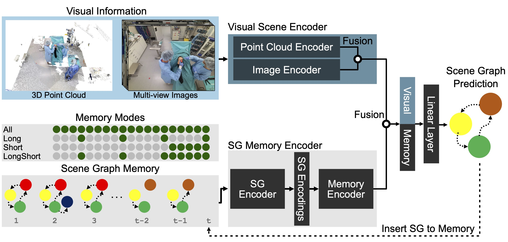

# LABRAD-OR: Lightweight Memory Scene Graphs for Accurate Bimodal Reasoning in Dynamic Operating Rooms

Official code of the paper LABRAD-OR: Lightweight Memory Scene Graphs for Accurate Bimodal Reasoning in Dynamic Operating Rooms (https://arxiv.org/abs/2303.13293) to be published at MICCAI 2023. LABRAD-OR introduces a novel way of using temporal information for more accurate and consistent holistic OR modeling.
Specifically, we introduce memory scene graphs, where the scene graphs of previous time steps act as the temporal representation guiding the current prediction. We design an end-to-end architecture
that intelligently fuses the temporal information of our lightweight memory scene graphs with the visual information from point clouds and images. We evaluate our method on the 4D-OR dataset and
demonstrate that integrating temporality leads to more accurate and consistent results achieving an +5% increase and a new SOTA of 0.88 in macro F1. 


**Authors**: [Ege Özsoy][eo], [Tobias Czempiel][tc], [Felix Holm][fh] , [Chantal Pellegrini][cp], [Nassir Navab][nassir]

[eo]:https://www.cs.cit.tum.de/camp/members/ege-oezsoy/

[tc]:https://www.cs.cit.tum.de/camp/members/tobias-czempiel/

[fh]:https://www.cs.cit.tum.de/camp/members/felix-holm/

[cp]:https://www.cs.cit.tum.de/camp/members/chantal-pellegrini/

[nassir]:https://www.cs.cit.tum.de/camp/members/cv-nassir-navab/nassir-navab/

```
@inproceedings{Özsoy2023_LABRAD_OR,
    title={LABRAD-OR: Lightweight Memory Scene Graphs for Accurate Bimodal Reasoning in Dynamic Operating Rooms},
    author={Ege Özsoy, Tobias Czempiel, Felix Holm, Chantal Pellegrini, Nassir Navab},
    booktitle={International Conference on Medical Image Computing and Computer-Assisted Intervention},
    year={2023},
    organization={Springer}
}
@inproceedings{Özsoy2022_4D_OR,
    title={4D-OR: Semantic Scene Graphs for OR Domain Modeling},
    author={Ege Özsoy, Evin Pınar Örnek, Ulrich Eck, Tobias Czempiel, Federico Tombari, Nassir Navab},
    booktitle={International Conference on Medical Image Computing and Computer-Assisted Intervention},
    year={2022},
    organization={Springer}
}
@inproceedings{Özsoy2021_MSSG,
    title={Multimodal Semantic Scene Graphs for Holistic Modeling of Surgical Procedures},
    author={Ege Özsoy, Evin Pınar Örnek, Ulrich Eck, Federico Tombari, Nassir Navab},
    booktitle={Arxiv},
    year={2021}
}
```

## What is not included in this repository?

The 4D-OR Dataset itself, Human and Object Pose Prediction methods as well as the downstream task of role prediction are not part of this repository. Please refer to the
original [4D-OR](https://github.com/egeozsoy/4D-OR) repository for information on downloading the dataset and running the 2D, 3D Human Pose Prediction and 3D Object Pose Prediction as well as the
downstream task of Role Prediction.

## Create Scene Graph Prediction Environment

- Recommended PyTorch Version: pytorch==1.10.0
- conda create --name labrad-or python=3.7
- conda activate labrad-or
- conda install pytorch==1.10.0 torchvision==0.11.0 torchaudio==0.10.0 cudatoolkit=11.3 -c pytorch -c conda-forge
- `cd` into scene_graph_prediction and run `pip install -r requirements.txt`
- Run `wget https://github.com/egeozsoy/LABRAD-OR/releases/download/v0.1/pretrained_models.zip` and unzip
- (Optional) To use the pretrained models, move files from the unzipped directory ending with `.ckpt` into the folder `scene_graph_prediction/scene_graph_helpers/paper_weights`
- `cd` into pointnet2_dir and run `CUDA_HOME=/usr/local/cuda-11.3 pip install pointnet2_ops_lib/.`
  Run `pip install torch-scatter==2.0.9 torch-sparse==0.6.12 torch-cluster==1.5.9 torch-spline-conv==1.2.1 torch-geometric==2.0.2 -f https://data.pyg.org/whl/torch-1.10.0+cu113.html`

## Scene Graph Prediction



As we built upon https://github.com/egeozsoy/4D-OR, the code is structured similarly.

- `cd` into scene_graph_prediction
- To train a new visual only model which only uses point cloud, run `python -m scene_graph_prediction.main --config visual_only.json`.
- To train a new visual only model which uses point cloud and images, run `python -m scene_graph_prediction.main --config visual_only_with_images.json`
- To train labrad-or which only uses point clouds, run `python -m scene_graph_prediction.main --config labrad_or.json`. This requires the pretrained visual only model to be present.
- To train labrad-or which uses point clouds and images, run `python -m scene_graph_prediction.main --config labrad_or_with_images.json`. This requires the pretrained visual only model to be present.
- We provide all four pretrained models https://github.com/egeozsoy/LABRAD-OR/releases/download/v0.1/pretrained_models.zip. You can simply use them instead of retraining your own models, as
  described in the environment setup.
- To evaluate either a model you trained or a pretrained model from us, change the mode to `evaluate` in the main.py and rerun using the same commands as before
  - If you want to replicate the results from the paper, you can hardcode the corresponding weight checkpoint as `checkpoint_path` in the main.py
- To infer on the test set, change the mode to `infer` again run one of the 4 corresponding commands. Again you can hardcode the corresponding weight checkpoint as `checkpoint_path` in the main.py
  - By default, evaluation is done on the validation set, and inference on test, but these can be changed.
- You can evaluate on the test set as well by using https://bit.ly/4D-OR_evaluator and uploading your inferred predictions.
- If you want to continue with role prediction, please refer to the original 4D-OR repository. You can use the inferred scene graphs from the previous step as input to the role prediction.
